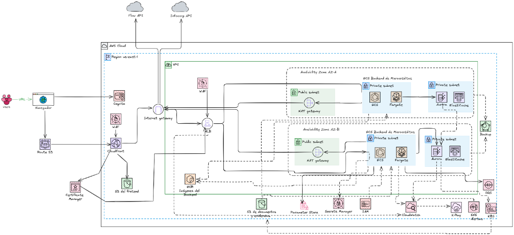

# Plataforma Transaccional de Microcréditos — Infraestructura como Código (IaC)

Este repositorio contiene la arquitectura completa de nube e infraestructura como código (IaC) en Terraform, empaquetamiento de aplicaciones y pipelines de automatización para la **Plataforma Transaccional de Microcréditos**.

---

## 1. Contexto del Proyecto
Este proyecto consiste en el aprovisionamiento, securización y automatización de la infraestructura en la nube para la **Plataforma Transaccional de Microcréditos**. La solución integra componentes de red aislados, almacenamiento inmutable de datos y registros de auditoría, orquestación de contenedores y bases de datos relacionales en alta disponibilidad.

---

## 2. Arquitectura de Nube (AWS)
La arquitectura sigue un patrón Multi-Tier desacoplado y seguro dentro de una red aislada en la región `us-east-1`:



---

## 3. Estructura del Repositorio
```text
├── .github/workflows/
│   ├── ci-terraform.yml
│   ├── ci-checkov.yml
│   ├── cd-terraform.yml
│   └── cd-back.yml
├── IaC_/
│   ├── providers.tf
│   ├── networking.tf
│   ├── segurity_groups.tf
│   ├── kms.tf
│   ├── s3.tf
│   ├── ecs.tf
│   ├── aurora.tf
│   ├── elasticache.tf
│   ├── secrets.tf
│   ├── parameter_store.tf
│   ├── cloudwatch.tf
│   ├── waf.tf
│   └── variables.tf
├── docs/
│   └── diagrama_arquitectura.png
├── app/
│   ├── backend/
│   │   └── Dockerfile
│   └── frontend/
└── README.md
```

---

## 4. Requisitos Previos
Para desplegar y administrar este entorno de manera local, asegúrate de tener instalados los siguientes componentes:

*   **Terraform** (versión `1.5.0` o superior)
*   **AWS CLI** (versión `2.x`) configurado con credenciales válidas de administrador.
*   **Docker Desktop** (para construcción local de imágenes y auditorías de Checkov)
*   **Checkov CLI** o Docker image (para escaneos locales de cumplimiento de seguridad)

---

## 5. Configuración y Despliegue Local

### 1. Inicializar Terraform
Descarga los proveedores de AWS y configura el backend de inicialización.
```bash
cd IaC_/
terraform init
```

### 2. Validar sintaxis y formateo
Comprueba la consistencia del código Terraform.
```bash
terraform fmt -check
terraform validate
```

### 3. Planificar Cambios
Visualiza las modificaciones de infraestructura que se realizarán en AWS.
```bash
terraform plan -out=tfplan
```

### 4. Aplicar Cambios
Aplica la infraestructura en tu entorno.
```bash
terraform apply tfplan
```

### 5. Escaneo de seguridad local (Checkov)
Ejecuta Checkov mediante Docker para validar que no haya regresiones en seguridad:
```bash
docker run --rm -v "${PWD}:/tf" --workdir /tf bridgecrew/checkov:3 --directory /tf
```

---

## 6. Variables Clave de Terraform

| Variable | Tipo | Default | Descripción |
|---|---|---|---|
| `environment` | `string` | `"dev"` | Nombre del entorno (dev, staging, prod) para el prefijo de recursos |
| `aws_region` | `string` | `"us-east-1"` | Región primaria de AWS para el despliegue |
| `vpc_cidr` | `string` | `"10.0.0.0/16"` | Rango de direccionamiento IP de la VPC |
| `documents_retention_days` | `number` | `3650` | Retención inmutable de contratos (Object Lock) en días (10 años) |
| `audit_retention_days` | `number` | `365` | Retención inmutable de logs en días (1 año) |
| `aurora_deletion_protection` | `bool` | `true` | Habilita la protección de borrado en Aurora PostgreSQL |
| `waf_rate_limit` | `number` | `100` | Límite de peticiones permitidas por IP antes de bloqueo en WAF |

---

## 7. Flujo de Despliegue Continuo (CI/CD)
El ciclo de vida del código está completamente automatizado a través de GitHub Actions:

### Integración Continua (Pull Requests a `dev`)
1.  **Lints y Format:** Se valida el formato de código Terraform con `terraform fmt`.
2.  **Validación de Sintaxis:** Se ejecuta `terraform validate` en seco.
3.  **Auditoría Estática de Seguridad:** Checkov analiza las plantillas de infraestructura y el Dockerfile buscando fallos de seguridad (puertos abiertos, cifrado ausente, etc.).
4.  **Calidad del Código:** SonarQube analiza el código del backend.

### Despliegue Continuo (Pushes a `dev`)
1.  **Despliegue de Infraestructura:** El pipeline ejecuta `terraform apply` de forma automática actualizando la topología de red, bases de datos y configuraciones.
2.  **Compilación y Despliegue de Contenedores:**
    *   Se construye la imagen Docker en base al `Dockerfile` usando a `appuser` (non-root) para cumplir con las políticas de ejecución de contenedores no privilegiados.
    *   La imagen se etiqueta y se sube de forma **inmutable** a su repositorio ECR.
    *   Se descarga la Task Definition actual del clúster de ECS Fargate, se actualiza el tag de la imagen, se registra y se despliega la nueva revisión sin pérdida de servicio.

---

## 8. Tecnologías Utilizadas
La plataforma integra las siguientes tecnologías y servicios para asegurar alta disponibilidad, rendimiento y cumplimiento de seguridad:

| Categoría | Tecnología/Servicio | Descripción / Uso en el Proyecto |
|---|---|---|
| **Infraestructura como Código** | Terraform v1.5+ | Aprovisionamiento y orquestación automatizada de recursos AWS. |
| **Capa de Cómputo** | AWS ECS Fargate & ECR | Orquestación de contenedores Serverless y registro inmutable de imágenes Docker. |
| **Redes & Conectividad** | AWS VPC, ALB & NAT Gateway | Aislamiento de red (Multi-AZ), balanceo de carga y salida segura a Internet. |
| **Bases de Datos & Caché** | Aurora PostgreSQL & ElastiCache Redis | Base de datos relacional altamente disponible y caché en memoria para lecturas rápidas. |
| **Almacenamiento** | Amazon S3 con Object Lock | Bucket frontend estático y almacenamiento inmutable (WORM) para logs de auditoría. |
| **Seguridad & Encriptación** | AWS KMS & WAFv2 | Cifrado en reposo mediante llaves CMK del cliente y firewall de aplicación con Rate Limiting. |
| **Gobernanza & Auditoría** | AWS CloudTrail & CloudWatch Logs | Trazabilidad completa de APIs de AWS y alertas de consumo de recursos. |
| **CDN & Distribución** | AWS CloudFront | Red de distribución de contenido global para la SPA de frontend con TLS. |
| **DevOps & Calidad** | GitHub Actions, Checkov & Docker | Pipelines de CI/CD automatizados, análisis de seguridad estático y empaquetamiento. |

---

## 9. Destrucción de la Infraestructura
Para eliminar por completo todos los recursos aprovisionados en AWS y detener la facturación de servicios, sitúate en la carpeta `IaC_/` y ejecuta el comando de destrucción:

```bash
cd IaC_/
terraform destroy -auto-approve
```

*Nota: Este comando destruirá bases de datos, subredes, balanceadores de carga y servicios de cómputo en Fargate. El bucket de estado remoto y la tabla de DynamoDB deben eliminarse manualmente desde la consola de administración de AWS si se desea remover toda la infraestructura persistente de estado.*

---

## 10. Dirección de Acceso al Sistema
Una vez finalizado el despliegue del pipeline y aprovisionada la distribución de CloudFront, puedes acceder al portal a través del siguiente enlace:

*   **Enlace de Acceso:** [Plataforma de Microcréditos](https://d1hd60otl26rw6.cloudfront.net/register)
